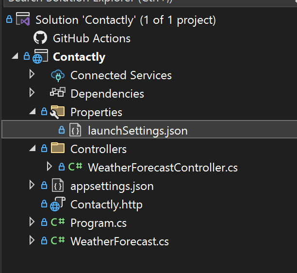
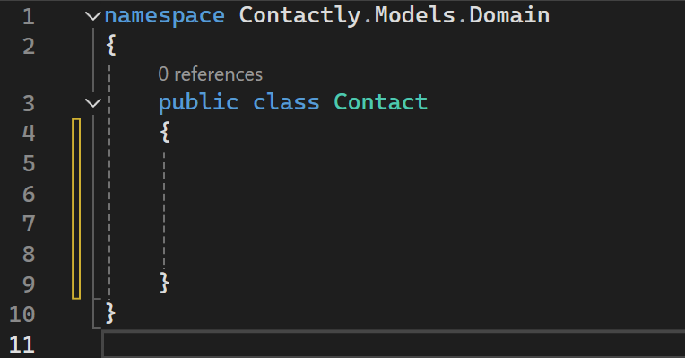

# Angular & .Net Full stack Web Development (CRUD OPERATIONS)

1. **Introduction**

**front end**: Angular  
**Back end:** .Net Web API  
**Storage:** Inmemory, SQL

---

2. **Requirements**

https://dotnet.microsoft.com/en-us/download/dotnet/thank-you/runtime-aspnetcore-8.0.6-windows-x64-binaries


https://nodejs.org/en


3.  **Install Angular CLI**

Angular version: 17.3.4
```
npm i @angular/cli@17.3.4
```

4. **Creating APIs using the visual studio**  
  i. Create a new project.  
  ii. ASP .NET Web API  
  iii. Chooce .Net 8    (Disable the top level statements)

5. FOLDER LAYOUT


use the run https: to run the API. SWAGER UI RUNS


6. Install Packages

Install this package in the package Manager

```

Microsoft.EntityFrameworkCore.InMemory
```

7. Create DOM

i. Create Model folder  
ii. Create a Domain folder in the Model  
iii. Create a contact class


  
_will fill the properties in this class_  


Syntax:

```
public <DataType> <required!> <Name> {get;set;} 
```

```
Guid
```


  


   


