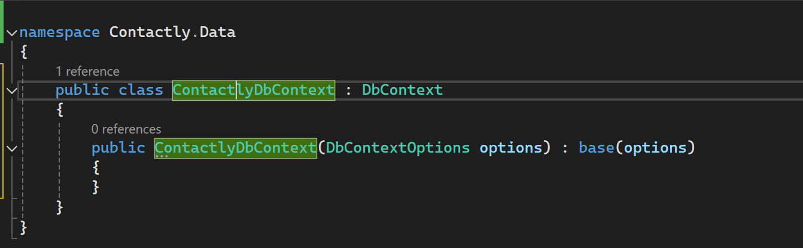
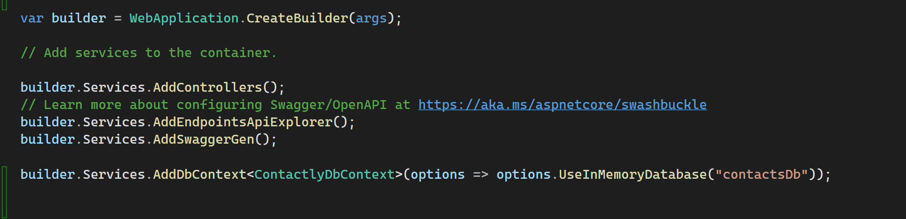
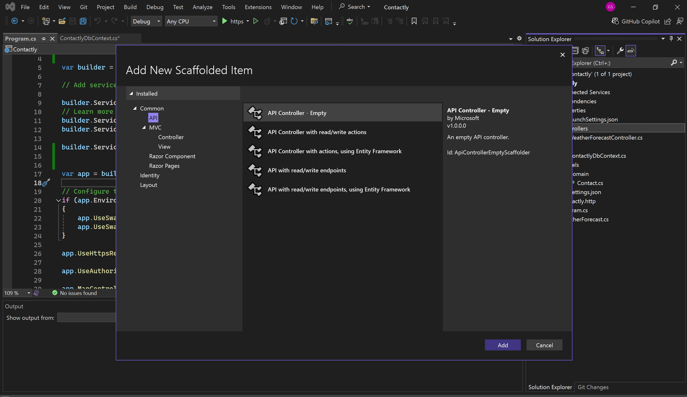
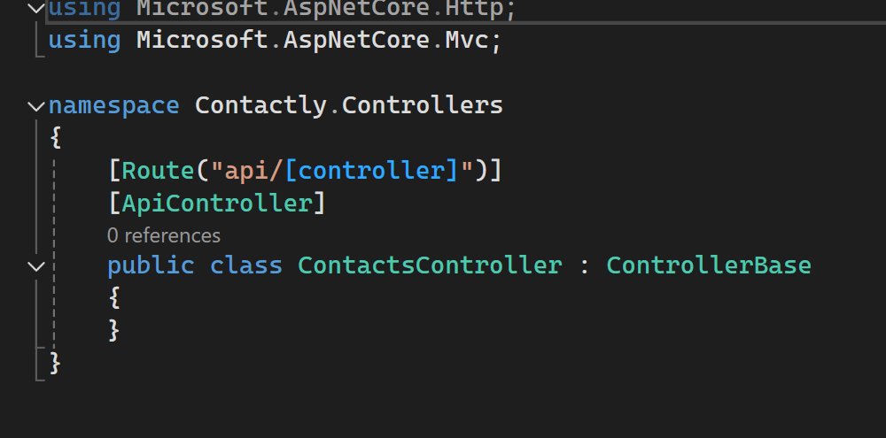
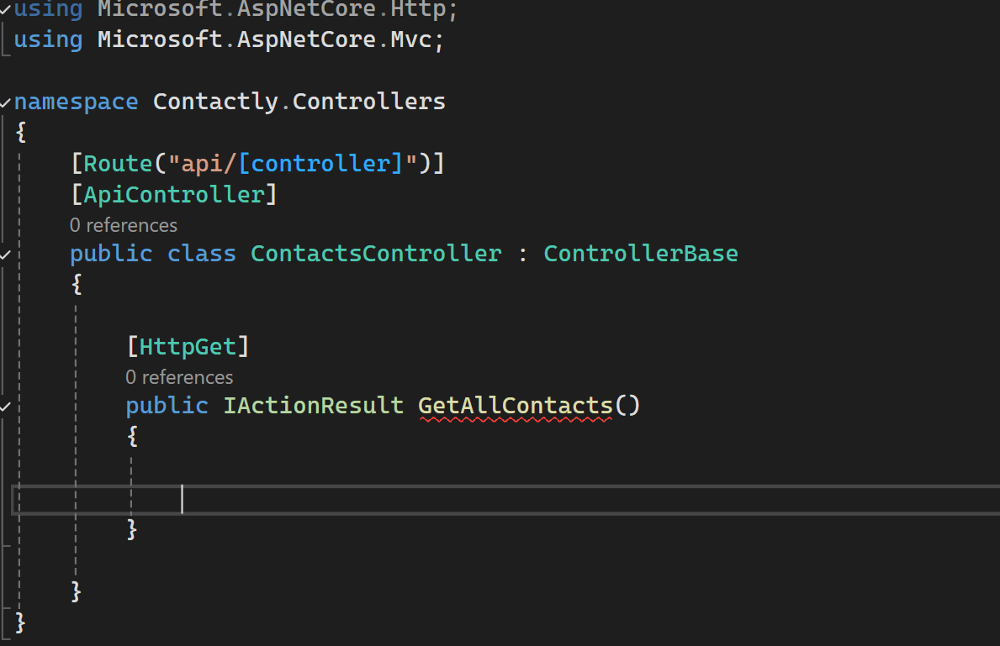

# Angular & .Net Full stack Web Development (CRUD OPERATIONS)

1. **Introduction**

**front end**: Angular  
**Back end:** .Net Web API  
**Storage:** Inmemory, SQL

---


2. **Requirements**

https://dotnet.microsoft.com/en-us/download/dotnet/thank-you/runtime-aspnetcore-8.0.6-windows-x64-binaries


https://nodejs.org/en

___


3.  **Install Angular CLI**

Angular version: 17.3.4
```
npm i @angular/cli@17.3.4
```
___

4. **Creating APIs using the visual studio**  
  i. Create a new project.  
  ii. ASP .NET Web API  
  iii. Chooce .Net 8    (Disable the top level statements)

  ___

5. FOLDER LAYOUT


use the run https: to run the API. SWAGER UI RUNS

___


6. Install Packages

Install this package in the package Manager

```

Microsoft.EntityFrameworkCore.InMemory
```

___

7. Create DOM

i. Create Model folder  
ii. Create a Domain folder in the Model  
iii. Create a contact class


  
_will fill the properties in this class_  


Syntax:

```
public <DataType><?!> <required!> <Name> {get;set;} 
``` 
? --> Value or null

```


Guid
Int
String
bool
```
___

8. DB Context class

i.Create a folder Data.  
ii. Add a new class (ContactlyBbContext.cs)  
iii.


_emptyclass_

iv. Inheridit the DbContext


_click the DbContext and press control+. and click install the package_


v. Create a constructor  


_Write click the class name. use control + . and click generate constructor with option parrameter_




vi.Add Properties 

shortcut(prop)


syntex of the property in the data

```
public DbSet<Model> <Name> {get; set;} 
```

vii. Inject it 

in the program.cs


_before_



_after_

syntax

```
builder.Services.AddDbContext<DatabaseName>(options => options.UseInMemoryDatabase("DatabaseOwnName"));

```

___


9. Controlers

i. Right click the contoller folder and click add control.



_in API CLICK THE OPTION ABOVE_

ii. The Empty controller


_The RouteName contoller is the name 0f controller_

iii. 



synatax:

```
public IActionResult CustomName()
{

}

```


  


   


